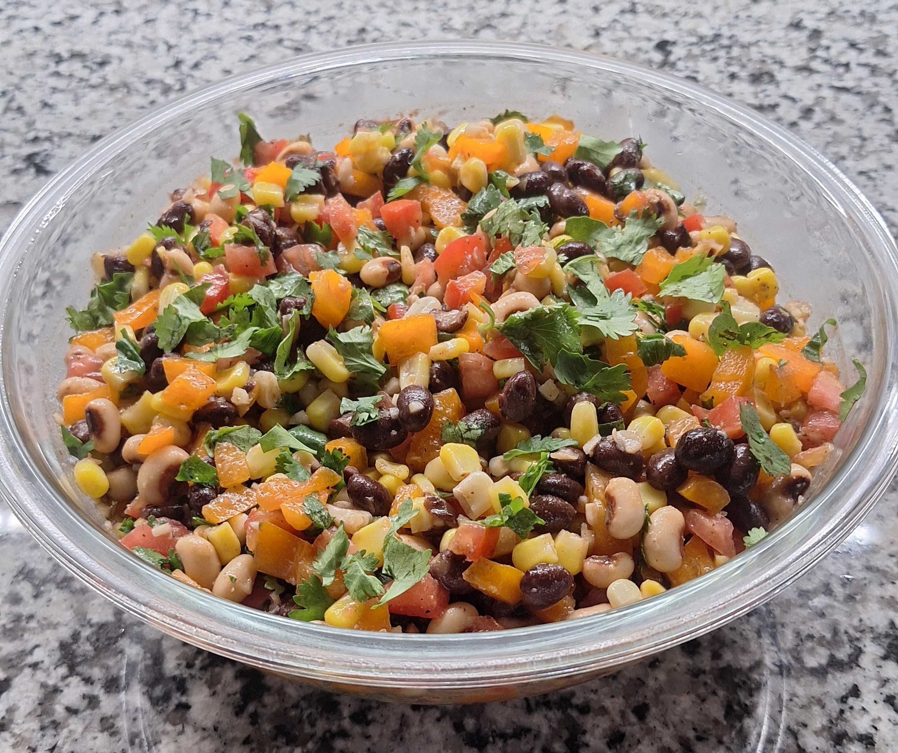

# Cowboy Caviar

### Ingredients

#### Vinagrette
- 2 Tbsp. olive oil
- Finly grated zest of 1 medium lime
- Juice of 1 medium lime
- 1 tsp. ground cumin
- 1/4 tsp. chili powder
- 1/4 tsp. dried oregano
- 1/4 tsp. black pepper

#### Caviar

- 1 (15 oz.) can black-eyed peas, drained and rinsed
- 1 (15 oz.) can black beans, drained and rinsed
- 3 cloves garlic, minced
- 2 medium Roma or plum tomatoes, seeded and diced
- 1 medium orange bell pepper, seeded and diced small
- 1/2 medium jalepeno pepper, diced small
- 1 cup fresh/thawed frozen corn kernels
- Chopped fresh cilantro

### Instructions

- Place all vinagrette  ingredients in large bowl and whisk until well-combined
- Add all caviar ingredients (except cilantro) into bowl of dressing and toss until well-combined. Refrigerate for minimum 1 hour, then toss again and garnish with cilantro.
- Serve with tortilla chips