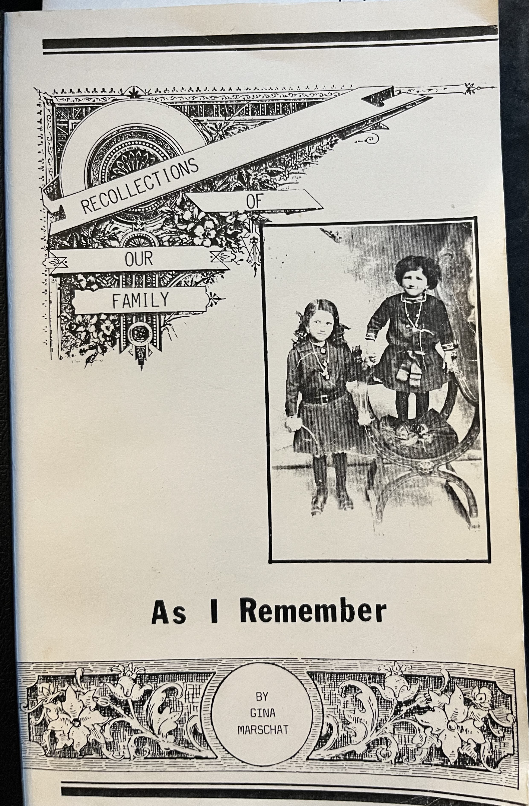
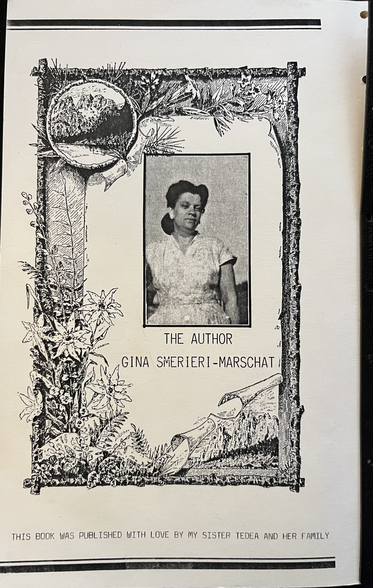

## Recollections of Our Family As I Remember
#### By Gina Marschat

  

    <h2>Page 1</h2>
    

My name is Gina. I was born in the town of Modena, Italy a long time ago. We were a family of five children and myself, that made us a family of six children. Also two twin boys that had only lived a few days. I faintly seem to remember them. If they had been born today, I am sure they would have lived.

Our father left us to come to America to seek his fortune. He would send for us later. At this time there were only three children. The twins were born a short time after our father left. For a short time we went to stay, until the twins were born, at our grandmother's house. We almost lost our mother, and the twin boys only lived a very short time.

I can still remember how our father looked from a large picture that hung on our kitchen wall. We were quite young when he left us. He was in full view of us. He was young and so handsome.

Dark wavy hair, a mustache and so beautiful us. When we looked at him, his eyes seemed to follow us and smile. He was so dear to us and we loved him so much. We all were living for the day that we would all be together in America.

My brother Lino was two years older than I was. Our sister Elsa Cristina was eighteen months younger than me. So small for her age. She was frail but so cute. We all kept a close and careful watch over her because she was sick a lot. The doctors said that she would outgrow all this as she got older. I do not believe now that they knew exactly what was wrong. No tests of any kind. Only their guess. Now many years later, I knew they were right. As we grew older, she grew

  

  

    <h2>Page 2</h2>
    
stronger and taller than I was. My sweet and very dear smaller sister. We were so close. We needed no other friends. We had each other. we were each other's best friend. Such a long time ago.
My sister was so much wiser than I
was •
I could always depend on her to
listen to my problems that would be so
upsetting to me.
She was so calm and
would just listen. She always had time for me.
She was the stronger of the two
of us.
I could always lean on her for her
opinion and comfort. She was one of God's gifts to all of us and especially to me.
I shall
always love her and miss her. I
shall
always love her and pray that the day will come when we can be together once more. Then I could tell her how much my heart aches for her. Who knows, she may already know.
She may be watching all of
her family and dear ones. Who knows?
When we were still in Italy we were
so poor.
Our mother was working in the
fields with other poor women. Working hard just keeping body and soul together.
This was during the first world war. All of the men except old men and very young boys had gone to war. Italy was at war with Germany. Such a poor country to be at war.
This country could hardly feed
its people. This we children would hear from the elders.
We were too young to
understand all this. So life just went on. The hard struggle to survive.
Our grandmother, whom we called Mama Vechia, meaning older mama, was well-to-do.
The hardship of the war did not seem
to affect her or Papa Vechio. Later on as times grew harder and harder, as we heard, they also were feeling the hardship. The

  

  

    <h2>Page 3</h2>
    
Morbi sit amet nunc ac nulla porta sagittis. Curabitur ultricies sapien
    ac libero fermentum, at sodales nunc volutpat. Aenean feugiat, lectus vel
    porta laoreet, nunc ex laoreet ipsum.

  

  <button id="prevBtn">← Previous</button>
  <button id="nextBtn">Next →</button>

